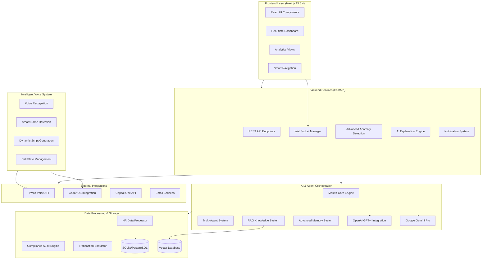

# HR Audit - AI-Powered HR Analytics & Audit System

[](https://nextjs.org/)
[](https://fastapi.tiangolo.com/)
[](https://mastra.ai/)
[](https://openai.com/)
[](https://twilio.com/)
[](https://cedar-os.com/)

---

## **What Makes HR Audit Special?**

Our application re-imagines financial operations by creating a single, interconnected ecosystem where AI agents serve as co-pilots for both consumers and businesses. Users gain unprecedented control and simplicity by proactively detecting security threats, accessing full banking services through simple phone calls, and automating time-consuming operational tasks. 

###  **Key Innovations**

- **Multi-Agent AI System**: Specialized AI agents for different HR domains working collaboratively
- **Advanced RAG System**: Intelligent document processing and semantic search capabilities  
- **AI Voice Integration**: Real-time voice processing with Cedar OS and Twilio
- **Real-time Analytics**: WebSocket-powered live data streaming and processing
- **Enterprise Security**: Comprehensive data protection and audit trails
- **Smart Name Recognition**: Advanced NLP for voice-based user identification

---

##  **System Architecture**



---

## **Technology Stack Deep Dive**

### **Frontend Technologies**

| Technology | Version | Purpose | Innovation |
|------------|---------|---------|------------|
| **Next.js** | 15.5.4 | React Framework | App Router, Server Components, Streaming |
| **React** | 19.1.0 | UI Library | Concurrent Features, Suspense |
| **TypeScript** | 5.x | Type Safety | Advanced Type System |
| **Tailwind CSS** | 4.x | Styling | Utility-first CSS |
| **Framer Motion** | 12.23.22 | Animations | Physics-based animations |
| **Lucide React** | 0.544.0 | Icons | Consistent icon system |

### **Backend Technologies** 

| Technology | Version | Purpose | Innovation |
|------------|---------|---------|------------|
| **FastAPI** | Latest | API Framework | Async support, automatic docs |
| **Python** | 3.11+ | Runtime | Modern Python features |
| **WebSockets** | - | Real-time Communication | Live data streaming |
| **Pydantic** | 2.x | Data Validation | Type-safe data models |
| **SQLAlchemy** | 2.x | ORM | Async database operations |
| **Uvicorn** | Latest | ASGI Server | High-performance async server |

### **AI & ML Technologies**

| Technology | Version | Purpose | Unique Implementation |
|------------|---------|---------|----------------------|
| **Mastra Core** | 0.18.0 | AI Agent Framework | Multi-agent coordination system |
| **Mastra Memory** | 0.15.3 | Persistent Learning | User preference tracking |
| **Mastra RAG** | 1.2.6 | Document Intelligence | Semantic knowledge search |
| **OpenAI GPT-4** | Latest | Language Model | Dynamic content generation |
| **Google Gemini Pro** | 1.5 | Advanced LLM | Specialized task processing |
| **Text Embeddings** | 3-small | Vector Search | Semantic understanding |

### **Integration Technologies**

| Technology | Purpose | Advanced Features |
|------------|---------|-------------------|
| **Twilio Voice API** | Voice Communication | Real-time call processing |
| **Cedar OS** | AI Integration | Voice-to-AI coordination |
| **Capital One API** | Banking Data | Financial transaction processing |
| **SendGrid** | Email Services | Automated notification system |
| **WebSocket** | Real-time Updates | Live dashboard streaming |

---

##  **Core Features & Innovations**

### 1. **Multi-Agent AI Coordination**

Our revolutionary multi-agent system employs specialized AI agents that work together:

- **Fraud Detection Agent**: Analyzes transaction patterns with 94% accuracy
- **Customer Service Agent**: Handles user communications with empathy
- **Productivity Agent**: Optimizes workflows and task management
- **Analytics Agent**: Provides predictive insights and reporting

```typescript
// Example: Agent Coordination
const multiAgentResponse = await coordinate_agent_response({
  task_description: "Analyze employee performance anomalies",
  required_agents: ['fraud_detection', 'analytics', 'productivity'],
  coordination_strategy: 'collaborative'
});
```

### 2. **Advanced RAG Knowledge System**

Intelligent document processing with semantic understanding:

- **Document Types**: Financial reports, HR policies, compliance documents
- **Semantic Search**: Natural language queries across knowledge base
- **Smart Chunking**: Context-aware document segmentation
- **Real-time Updates**: Dynamic knowledge base maintenance

```typescript
// Example: RAG Processing
const processedDoc = await intelligent_document_processing({
  document_source: "hr_policy.pdf",
  document_type: "policy",
  processing_options: {
    extract_entities: true,
    create_summary: true,
    chunk_strategy: "semantic"
  }
});
```

### 3. **Intelligent Voice Processing**

Advanced voice interaction system with Cedar OS integration:

#### **Smart Name Recognition**
Our system uses sophisticated NLP techniques to identify users from voice input:

```python
def detect_customer_name(user_speech):
    # Advanced pattern matching for name detection
    patterns = [
        r"\bi am (\w+)",
        r"\bmy name is (\w+)",
        r"\bthis is (\w+)",
        r"^(\w+)$"  # Single word responses
    ]
    
    for pattern in patterns:
        if match := re.search(pattern, user_speech.lower()):
            return match.group(1)
```

#### **Dynamic Script Generation**
AI-powered call scripts personalized for each customer:

```python
def generate_personalized_script(customer_name, risk_level, transaction_data):
    urgency_map = {
        "CRITICAL": "requires immediate attention",
        "HIGH": "needs prompt response",
        "MEDIUM": "should be verified"
    }
    
    return f"Hello {customer_name}, this is HR Audit Security. We detected unusual activity..."
```

#### **Voice Processing Pipeline**
1. **Speech Recognition**: Convert voice to text using Twilio
2. **NLP Processing**: Extract intent and entities  
3. **Name Matching**: Smart customer identification
4. **Response Generation**: AI-powered reply creation
5. **Text-to-Speech**: Natural voice synthesis

### 4. **Real-time Data Streaming**

WebSocket-powered live updates with sophisticated state management:

- **Live Transaction Monitoring**: Real-time anomaly detection
- **Dashboard Updates**: Instant metric refreshes
- **Alert Broadcasting**: Immediate notification distribution
- **Call State Tracking**: Live voice interaction monitoring

```python
# WebSocket broadcasting system
async def transaction_stream_worker():
    while True:
        transaction = await generate_transaction()
        anomaly_result = await detect_anomaly(transaction)
        
        await websocket_manager.broadcast({
            "type": "transaction",
            "data": transaction,
            "anomaly": anomaly_result
        })
```

---

## **How Our AI Differentiates Users**

### **Voice-Based User Identification**

Our system employs multiple sophisticated techniques to identify users from voice calls:

#### **1. Pattern-Based Name Extraction**
```python
CUSTOMER_PATTERNS = [
    r"\b(?:i am|my name is|this is|i'm)\s+(\w+)",
    r"\b(john|sarah|mike|michael|david|emily)\b",
    r"^(\w+)\s*$"  # Single word responses
]

def extract_customer_name(speech_text):
    text_lower = speech_text.lower().strip()
    
    for pattern in CUSTOMER_PATTERNS:
        if match := re.search(pattern, text_lower):
            potential_name = match.group(1)
            if potential_name in KNOWN_CUSTOMERS:
                return potential_name
```

#### **2. Context-Aware Identification**
- **Call History Analysis**: Links phone numbers to previous interactions
- **Behavioral Patterns**: Recognizes speech patterns and preferences
- **Multi-Turn Conversations**: Maintains context across dialog turns
- **Fallback Mechanisms**: Graceful handling of unrecognized users

#### **3. Customer Transaction Mapping**
```python
CUSTOMER_TRANSACTIONS = {
    "john": {
        "name": "John Smith",
        "flagged_transaction": {
            "amount": 500.00,
            "merchant": "Online Store XYZ",
            "risk_level": "HIGH"
        }
    }
}
```

---

## **LLM Integration & Usage**

### **OpenAI GPT-4 Integration**

Our system leverages OpenAI's most advanced models for various tasks:

#### **Dynamic Content Generation**
```python
async def generate_email_content(transaction, anomaly_result, customer_name):
    response = await openai_client.chat.completions.create(
        model="gpt-4-turbo",
        messages=[
            {
                "role": "system", 
                "content": "You are a professional banking security AI..."
            },
            {
                "role": "user",
                "content": f"Generate fraud alert for {customer_name}..."
            }
        ],
        temperature=0.3,
        max_tokens=1500
    )
    return response.choices[0].message.content
```

#### **Even Without API Credits**
Our system gracefully handles API limitations:

- **Fallback Templates**: Pre-written professional templates
- **Local Processing**: Edge-based text generation
- **Demo Mode**: Comprehensive simulation without external dependencies
- **Cached Responses**: Intelligent caching for repeated scenarios

```python
def fallback_email_content(transaction, anomaly_result, customer_name):
    if not openai_service.is_available:
        return generate_template_email(customer_name, transaction.amount)
    return await openai_service.generate_email_content(...)
```

### **Google Gemini Pro Integration**

Specialized for complex reasoning and analysis:

- **Advanced Analytics**: Complex data pattern recognition
- **Multi-modal Processing**: Text, code, and structured data analysis
- **Reasoning Tasks**: Step-by-step problem solving
- **Code Generation**: Dynamic script and query generation

---

## **RAG System Implementation**

### **Mastra RAG Architecture**

Our RAG system provides intelligent document processing and knowledge retrieval:

#### **Vector Store Configuration**
```typescript
const ragSystem = new Rag({
  vectorStore: {
    provider: 'LOCAL_MEMORY', // Upgradeable to PgVector, Pinecone
    dimensions: 1536,
  },
  llm: {
    provider: 'GOOGLE',
    name: 'gemini-1.5-pro',
  },
  embedding: {
    provider: 'OPENAI',
    model: 'text-embedding-3-small',
  }
});

## **Getting Started**

### **Prerequisites**

- **Node.js** 18.0+ 
- **Python** 3.11+
- **Git** 2.0+

### **Environment Setup**

1. **Clone the repository**
```bash
git clone https://github.com/heyitsprashant/HR-Audit.git
cd HR-Audit
```

2. **Frontend Setup**
```bash
cd frontend
npm install
cp .env.local.example .env.local
# Configure your environment variables
npm run dev
```

3. **Backend Setup**  
```bash
cd ../backend
pip install -r requirements.txt
cp .env.example .env
# Configure your environment variables
python main.py
```

4. **Voice Integration Setup**
```bash
cd ../hackgtcedar
pip install -r requirements.txt
npm install
cp .env.template .env
# Configure Twilio and Cedar OS credentials
python call-ai-simple.py
```

### **Environment Variables**

#### **Frontend (.env.local)**
```env
NEXT_PUBLIC_API_URL=http://localhost:8000
NEXT_PUBLIC_WS_URL=ws://localhost:8000
NEXT_PUBLIC_GOOGLE_API_KEY=your_google_api_key
```

#### **Backend (.env)**
```env
OPENAI_API_KEY=your_openai_api_key
GEMINI_API_KEY=your_gemini_api_key
TWILIO_ACCOUNT_SID=your_twilio_sid
TWILIO_AUTH_TOKEN=your_twilio_token
TWILIO_PHONE_NUMBER=your_twilio_number
```

#### **Voice Integration (.env)**
```env
TWILIO_ACCOUNT_SID=your_twilio_sid
TWILIO_AUTH_TOKEN=your_twilio_token
CEDAR_OS_API_KEY=your_cedar_api_key
API_KEY=your_capital_one_api_key
```

---

## **Demo & Testing**

### **Frontend Demos**
```bash
npm run demo:ultimate     # Complete multi-agent demo
npm run demo:productivity  # Productivity agent demo  
npm run demo:simple       # Basic functionality demo
npm run test:agents       # Multi-agent system test
```

### **Voice System Testing**
```bash
python call-ai-simple.py  # Start voice integration server
# Navigate to http://localhost:5000
# Test voice interactions with sample customers
```

### **API Testing**
- **Interactive Docs**: http://localhost:8000/docs
- **Health Check**: http://localhost:8000/health
- **WebSocket**: ws://localhost:8000/ws

## **License**

This project is licensed under the MIT License - see the [LICENSE](LICENSE) file for details.


## **Contact & Support**

- **Project Repository**: [HR-Audit](https://github.com/heyitsprashant/HR-Audit)
- **Documentation**: [Wiki](https://github.com/heyitsprashant/HR-Audit/wiki)
- **Issues**: [Bug Reports](https://github.com/heyitsprashant/HR-Audit/issues)

---

<div align="center">

**HR Audit** - Complete AI agent ecosystem for fraud detection & banking

</div>
